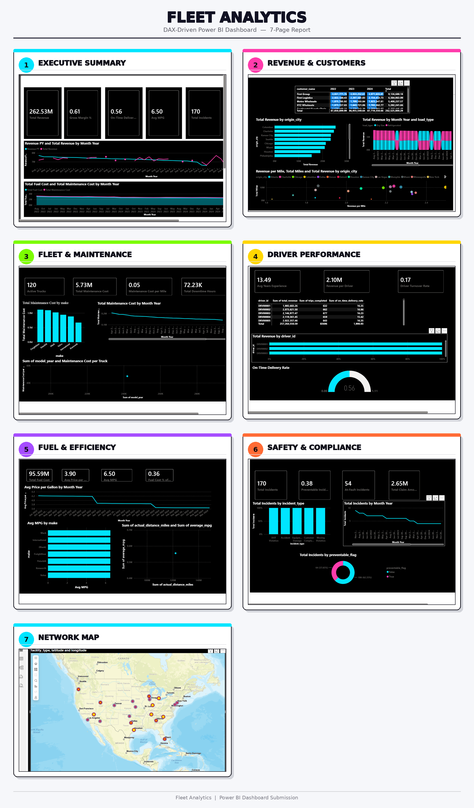

🚛 Fleet Analytics Dashboard

A 7-page, DAX-driven Power BI dashboard built on a 14-table logistics/fleet operations dataset (drivers, trucks, trailers, customers, facilities, routes, loads, trips, fuel purchases, maintenance records, delivery events, safety incidents, and monthly driver/truck metrics).

## 📊 Dashboard Preview

## 📥 Download

**[⬇️ Download the .pbix file](https://raw.githubusercontent.com/don-zeez/Data-Analytics-Portfolio/main/fleet-analytics-powerbi/FLEET%20ANALYTICS.pbix)** — open it in [Power BI Desktop](https://www.microsoft.com/en-us/power-platform/products/power-bi/downloads) (free) to explore the full interactive report.

> Note: GitHub can't render a live preview of `.pbix` files in the browser — that's a GitHub limitation, not an issue with the file. Download it and open it in Power BI Desktop to interact with it, or just browse the screenshot above for a quick look.

## 🗂️ What's inside

A custom **Date table** plus a dedicated **`_Measures`** table holding ~44 DAX measures, organized into display folders by theme:

- **Revenue & Loads** — Total Revenue, Revenue YoY %, Revenue Running Total, and more
- **Trips & Delivery** — Total Miles, On-Time Delivery Rate, Revenue per Mile
- **Fuel** — Total Fuel Cost, Avg MPG, Fuel Cost % of Revenue
- **Maintenance & Fleet** — Maintenance Cost per Mile, Truck Utilization Rate
- **Safety** — Preventable Incident Rate, Incidents per 100k Miles
- **Drivers** — Revenue per Driver, Driver Turnover Rate
- **Profitability** — Gross Margin, Gross Margin %

## 📑 Report pages

| Page | What it covers |
|---|---|
| **Executive Summary** | Top-line KPIs, revenue trend vs. prior year, operating cost trend, revenue by customer type |
| **Revenue & Customers** | Customer × year revenue matrix, revenue by route, revenue by load type over time |
| **Fleet & Maintenance** | Maintenance cost by truck make, cost trend, cost vs. truck age |
| **Driver Performance** | Driver leaderboard, on-time delivery rate, revenue per driver |
| **Fuel & Efficiency** | Fuel price trend, MPG by truck make, efficiency vs. trip distance |
| **Safety & Compliance** | Incidents by type and over time, preventable vs. non-preventable split |
| **Network Map** | Facility locations plotted geographically |

## 🛠️ Tools used

Power BI Desktop · DAX · Power Query (M) · Data modeling (star-schema-style relationships across 14 tables)

## 📁 Files in this folder

- `FLEET ANALYTICS.pbix` — the full Power BI project file
- `Fleet_Analytics_Dashboard_Bold.png` — static preview image of all 7 pages
- `README.md` — this file

---
⬅️ [Back to main portfolio](https://github.com/don-zeez/Data-Analytics-Portfolio)
