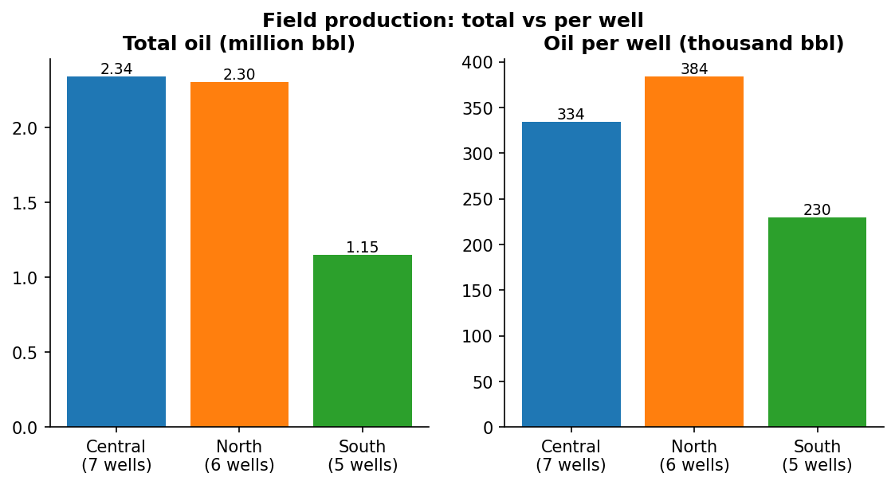
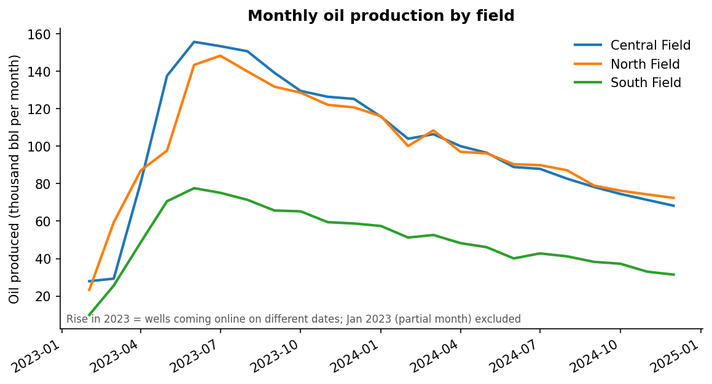
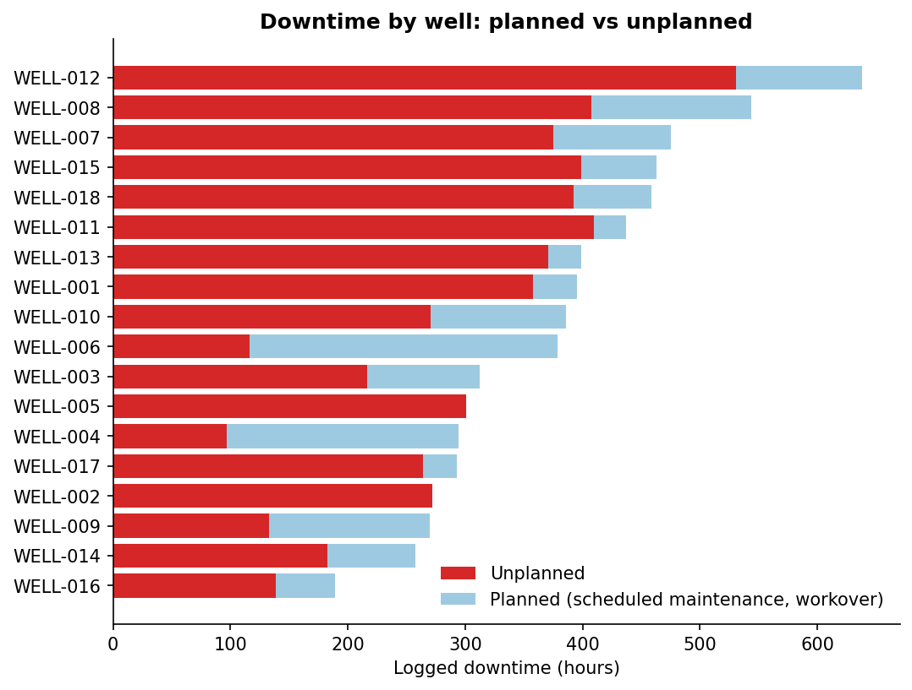
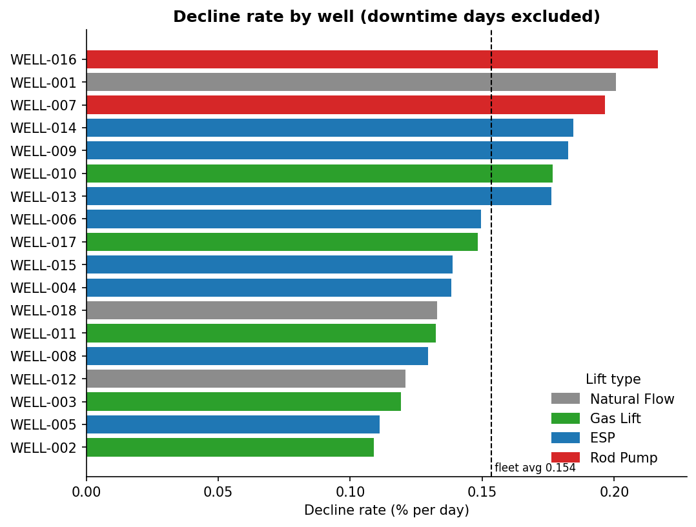
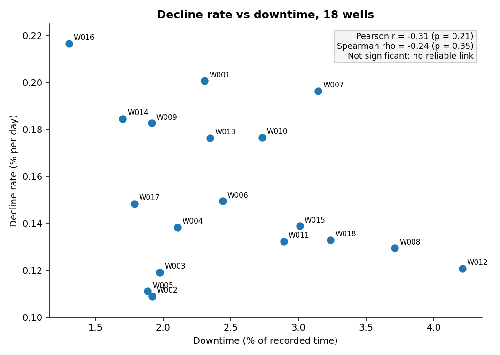
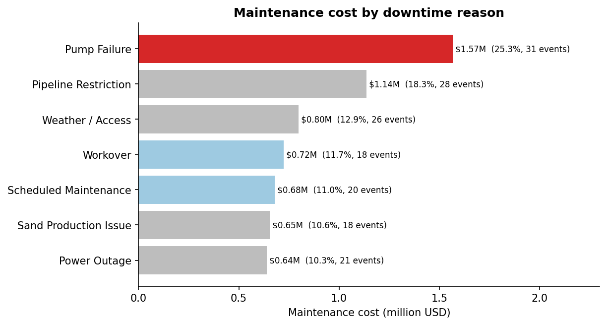
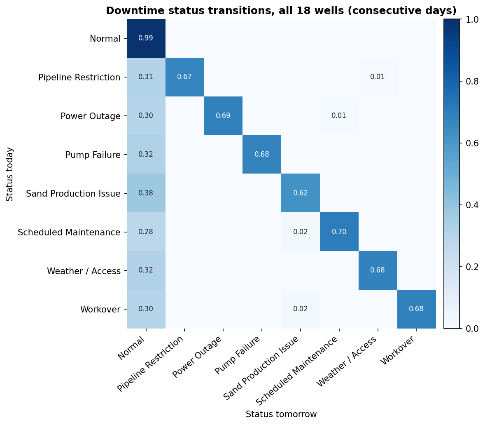
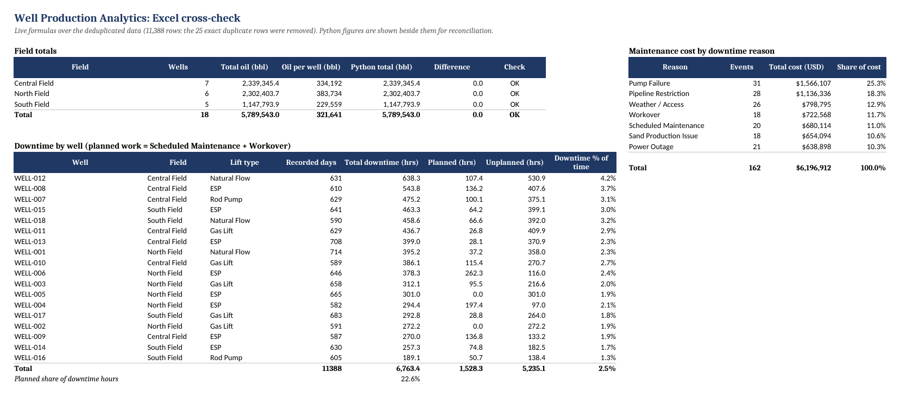
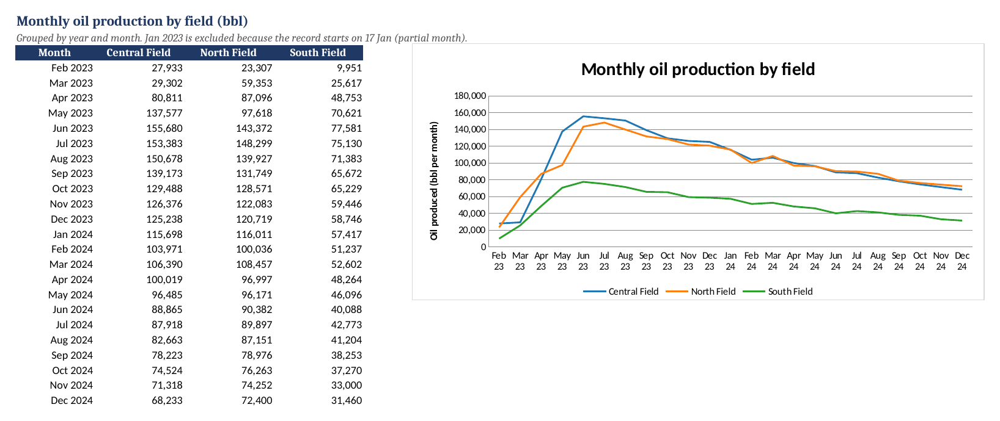

# 🛢️ Well Production Analytics

**Python, SQL and Excel analysis of two years of daily oil-well production: which wells decline fastest, where does downtime cost concentrate, and how do downtime events behave day to day?**

`Python` · `pandas` · `SciPy` · `scikit-learn` · `Matplotlib` · `SQL Server` · `Excel` · `Markov chain` · `Oil & Gas`

---

## 📌 At a glance

| 🛢️ Wells | 🗺️ Fields | 📅 Period | 🧾 Rows (clean) | ⛽ Total oil | ⏱️ Downtime |
|:---:|:---:|:---:|:---:|:---:|:---:|
| **18** | **3** | **Jan 2023 to Dec 2024** | **11,388** | **5.79M bbl** | **6,763 hrs** |

---

## 🎯 Business questions

1. Which fields produce the most oil, and how does production change over time?
2. Which wells have the most downtime, and how much of it is unplanned?
3. Which wells are declining fastest?
4. Are downtime and decline the same problem, or two different ones?
5. How long does downtime last, and does one failure lead to another?

---

## 💡 Key findings

### 1. Central and North are almost level, but South has fewer wells
Central produced 2,339,345 bbl and North 2,302,404 bbl, only about 1.6% apart. South produced about half as much (1,147,794 bbl), partly because it has fewer wells (Central 7, North 6, South 5). Per well, North leads.

All three fields rise through 2023 because wells came online on different dates, peak in mid-2023, then decline steadily.

### 2. Downtime is spread across several wells, and about 23% of it is planned
WELL-012 has the most logged downtime (638 hrs), then WELL-008 (544), WELL-007 (475), WELL-015 (463) and WELL-018 (459). Scheduled Maintenance and Workover are planned work and make up 22.6% of logged hours. Excluding them, WELL-012 still leads (531 hrs).

### 3. WELL-016, WELL-001 and WELL-007 decline fastest
WELL-016 declines at 0.217% per day, then WELL-001 (0.201%) and WELL-007 (0.196%). The fleet average is 0.154% per day. Both rod-pump wells (WELL-016 and WELL-007) are among the three fastest, averaging 0.206% against 0.14 to 0.15% for the other lift types. With only two rod-pump wells, this is a lead to investigate, not proof.

### 4. No reliable link between downtime and decline
The relationship across the 18 wells is weak and not statistically significant (Pearson r = -0.31, p = 0.21; Spearman rho = -0.24, p = 0.35). With 18 wells, the data cannot say whether the two are related. Individual wells still stand out: WELL-012 and WELL-008 have the most downtime but below-average decline, and WELL-007 has both high decline and high downtime.

### 5. Pump failures are the largest maintenance cost
31 pump-failure events cost $1.57M, 25.3% of the $6.2M total. The light-blue bars below are planned work.

### 6. Downtime is rare, lasts about 3 days, and rarely cascades (Markov chain)
Treating each day's status as a state (Normal or one of seven downtime reasons) and counting day-to-day transitions across all wells:

- **Starting:** a normal day is followed by another normal day 98.6% of the time, so about 1.4% of normal days start a downtime event.
- **Duration:** every downtime reason has a 62% to 70% chance of continuing the next day, which means an average of 2.6 to 3.3 days. That matches the mean event duration in `downtime_events.csv` (2.6 to 3.3 days), a useful consistency check between the two tables.
- **Cascades are rare:** only 4 of 490 downtime days switch straight to a different reason. Downtime almost always returns to Normal first.
- **Model fit:** the long-run share of normal days implied by the matrix (95.6%) matches the observed share (95.7%).
- **Most downtime-prone wells:** WELL-012 and WELL-008 spend the largest share of days in downtime (6.8% and 6.6%).

The reasons look almost identical in duration. That is typical of synthetic data. Real data would be expected to show clearer differences, for example longer workovers than weather delays.

---

## ✅ Recommendation

These are hypotheses to test, not proven causes:

- **Maintenance:** inspect **WELL-012 and WELL-008** first. They have the most downtime but below-average decline, so the cause may be equipment, not the reservoir.
- **Decline:** evaluate **WELL-016 and WELL-001** for a workover or artificial-lift upgrade. Their decline is steep while downtime is lower.
- **WELL-007** may need both, and the **rod-pump wells** deserve a closer look.

---

## 🛠️ How it was built

1. **Cleaning (Python):** found and removed **25 exact-duplicate `(date, well_id)` rows** (11,413 to 11,388), noted 120 missing wellhead pressure readings, and confirmed every well has an unbroken daily record.
2. **Reconciling Python, SQL and Excel:** all three give the same totals once duplicates are removed. SQL ran on the raw table first, so its totals were 0.16% to 0.20% higher, a concrete example of why cleaning comes first.
3. **Decline rates:** for each well, fitted a straight line to the **log of daily oil rate** with scikit-learn `LinearRegression`, using real elapsed days and excluding downtime days (output on those days is scaled down by the share of the day the well was offline). The slope gives an exponential decline rate in percent per day.
4. **Downtime vs decline:** measured downtime as a share of each well's recorded time and compared it with decline rates using Pearson and Spearman correlation with p-values (SciPy).
5. **Markov chain:** built day-to-day transition matrices from consecutive calendar days only, for single wells and pooled across all wells.

### Excel cross-check
`excel/wells_analysis.xlsx` rebuilds the field totals, monthly production, downtime by well and maintenance cost with live `SUMIFS` formulas. Each Python figure is shown next to its Excel figure with an OK check.

### SQL (SQL Server)
`sql/well_production_queries.sql` finds the duplicates, builds a deduplicated view with `ROW_NUMBER()`, and reproduces the field totals, downtime ranking, planned-downtime share and maintenance cost by reason.

---

## ⚠️ Limitations

- The dataset is **synthetic**, so the findings demonstrate the method rather than a real field.
- A log-linear fit assumes exponential decline, which simplifies real reservoir behaviour.
- The downtime-versus-decline test uses only 18 wells and is not significant. The rod-pump comparison uses 2 wells.
- The Markov chain assumes tomorrow depends only on today's status.
- The events table implies about 12,024 downtime hours (501 days x 24), against 6,763 logged in the production table. The two agree on days (501 vs 492), and the production table records an average of about 13.7 hours on a downtime day, so it logs partial-day outages.

---

## 📊 Data

| File | Rows | Contents |
|---|--:|---|
| `wells_production.csv` | 11,413 | Daily oil, gas, water, pressure and downtime per well |
| `wells_master.csv` | 18 | Well, field, start offset and artificial-lift type |
| `downtime_events.csv` | 162 | Downtime events with reason, duration and cost |

---

## 📁 Files in this folder

| Path | Description |
|---|---|
| [`notebooks/my_analysis.ipynb`](notebooks/my_analysis.ipynb) | Cleaning, field totals, decline rates, downtime, maintenance cost, Markov chain |
| [`sql/well_production_queries.sql`](sql/well_production_queries.sql) | Duplicate check, deduplicated view, totals, downtime, cost |
| [`excel/wells_analysis.xlsx`](excel/wells_analysis.xlsx) | Formula-based cross-check with a monthly chart |
| [`FINDINGS.md`](FINDINGS.md) | Full write-up |
| `images/` | Charts used in this README |
| `data/` | The three CSV files |

## ▶️ How to run

1. Put the three CSV files in `data/` (or next to the notebook).
2. Open `notebooks/my_analysis.ipynb` and choose **Restart & Run All**. Python 3 with `pandas`, `numpy`, `scipy`, `scikit-learn` and `matplotlib` is needed.
3. For SQL, create a database called `wells_db`, import the CSVs as tables with the same names as the files, and run the `.sql` file.
