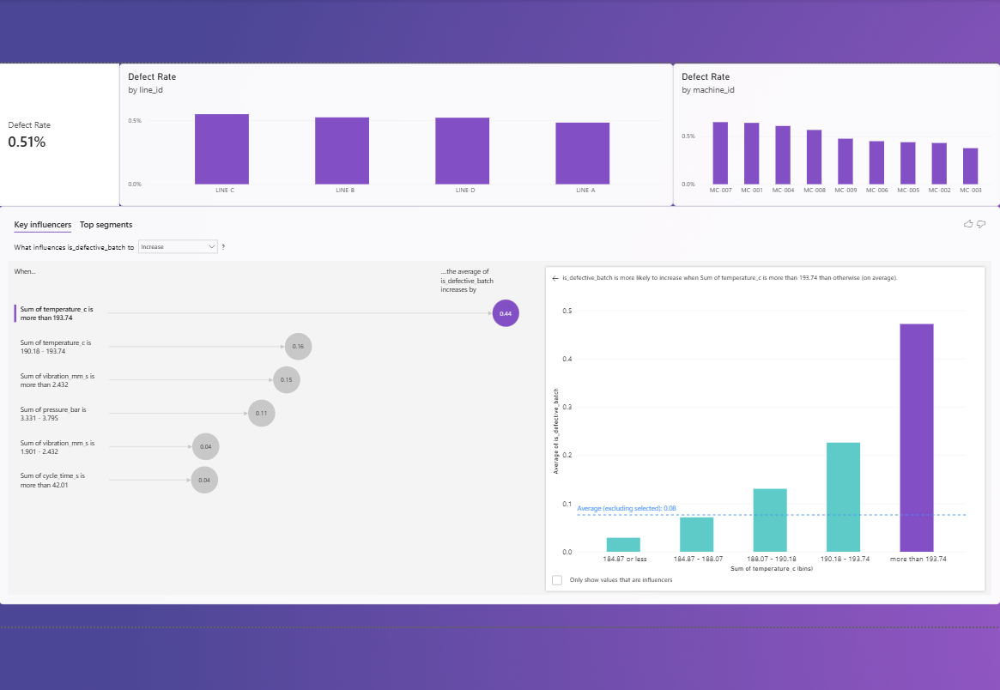

# 🏭 Manufacturing Quality Analytics

**A Power BI report that finds which production lines and machines have the highest defect rates, and what is driving defective batches.**

`Power BI` · `Power Query` · `DAX` · `Key Influencers` · `Manufacturing`



---

## 📌 At a glance

| 🧾 Production runs | 📅 Period | 🏭 Lines | ⚙️ Machines | ❌ Unit defect rate | 📦 Defective batches |
|:---:|:---:|:---:|:---:|:---:|:---:|
| **22,680** | **Jan 2023 to Feb 2024** | **4** | **9** | **0.51%** | **8.6%** |

---

## 🎯 Business problem

Quality engineering needs to know which lines and machines are underperforming on defect rate, and **why**, not just where.

---

## 💡 Key findings

1. **LINE-C has the highest defect rate** at about **0.55%** of units, compared with 0.48% for LINE-A, the best line. The gap between lines is real but modest.
2. **MC-007 (LINE-C) is the worst machine** at about **0.65%**, with MC-001 (LINE-A) close behind at 0.64%.
3. **Temperature is the strongest driver.** Power BI's Key Influencers visual ranked `temperature_c` first. Defect likelihood rises sharply above about **193.74 °C**. In the raw data, roughly **47% of runs above that temperature were defective, against 8.6% overall**.
4. **MC-007 has the most temperature spikes.** About **6.2%** of its runs went above 193.74 °C, more than any other machine (MC-001: 4.8%, MC-004: 4.4%, most others under 2%).
5. **Vibration, pressure and cycle time are secondary factors**, in that order.

---

## ✅ Recommendation

Inspect **MC-007** first, then **MC-001** and **MC-004**, for temperature control or cooling problems. These machines run hot most often, and hot runs are where defects concentrate. Fixing temperature spikes is a more precise target than a line-wide process change.

---

## 🛠️ How it was built

1. **Power Query cleaning**
   - Removed **40 duplicate `run_id` rows** with Remove Duplicates
   - Filled **150 missing `vibration_mm_s` readings** with Fill Down (nearest earlier reading, a simple choice for a continuous sensor stream)
2. **One DAX measure**
   ```DAX
   Defect Rate = DIVIDE(SUM(defect_units), SUM(units_produced))
   ```
3. **Visuals:** KPI card, defect rate by line, defect rate by machine
4. **Key Influencers (no-code AI):** analysed which sensor readings are most associated with a defective batch, with no model code written

---

## 📊 Data

Production-run records across 4 lines and 9 machines, with process sensor readings (temperature, pressure, vibration, cycle time) and a defective-batch flag per run.

This is a **synthetic dataset** built for practice, not real factory data.

| File | Contents |
|---|---|
| `production_runs.csv` | 22,720 raw rows (22,680 after removing duplicates) |
| `machines_master.csv` | 9 machines with their line and age |
| `downtime_events.csv` | 153 downtime events with cost |

---

## 📁 Files in this folder

| File | Description |
|---|---|
| [`PowerBi/Manufacturing_Quality_MYWORK.pbix`](PowerBi/Manufacturing_Quality_MYWORK.pbix) | The Power BI report |
| [`FINDINGS.md`](FINDINGS.md) | Full write-up |
| `data/` | The three CSV files |

## ▶️ How to open

1. Download `Manufacturing_Quality_MYWORK.pbix` from the `PowerBi` folder.
2. Open it in the free [Power BI Desktop](https://powerbi.microsoft.com/desktop/).
3. All cleaning steps, the DAX measure and the visuals are saved inside the file.
