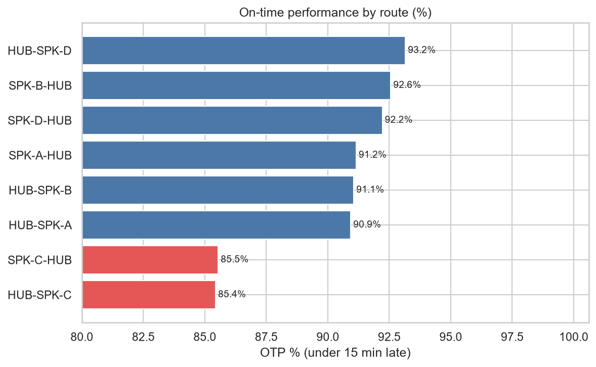
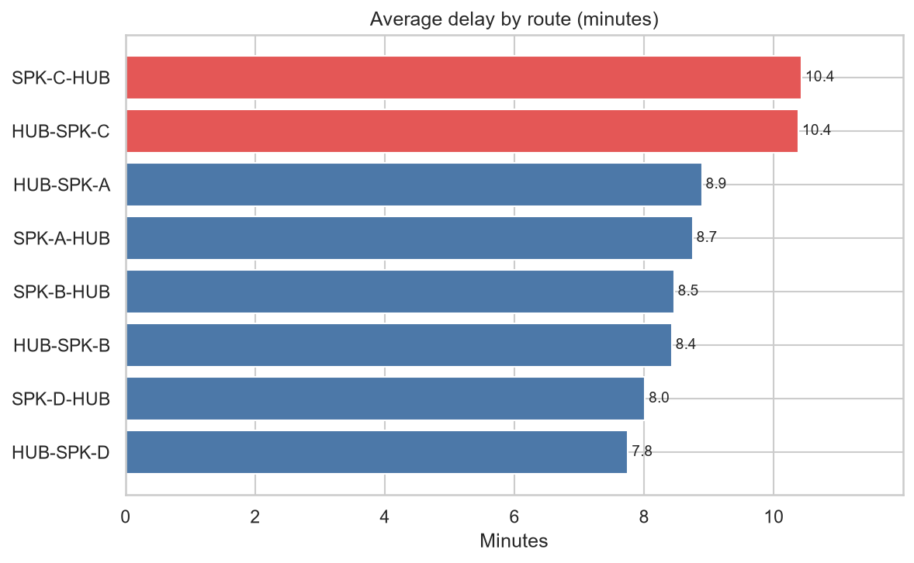
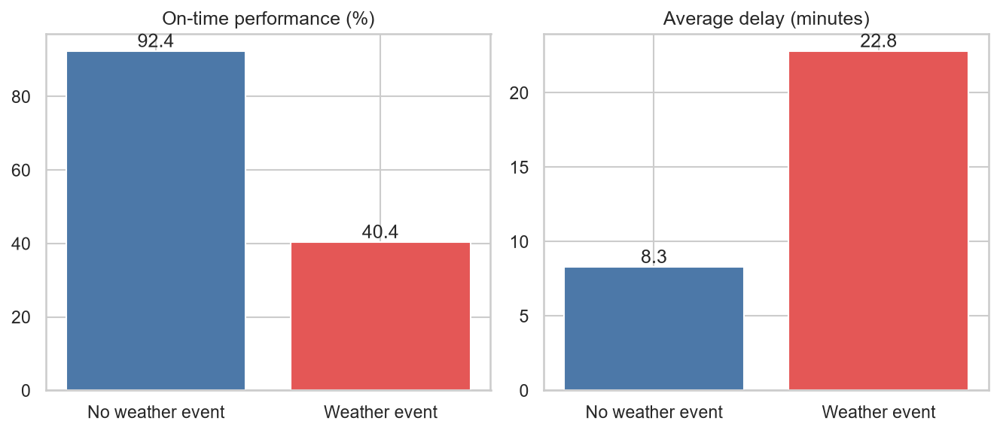
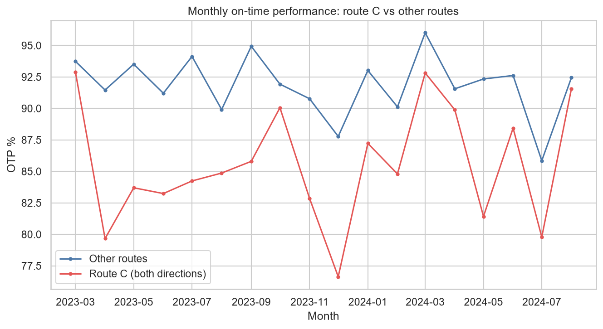
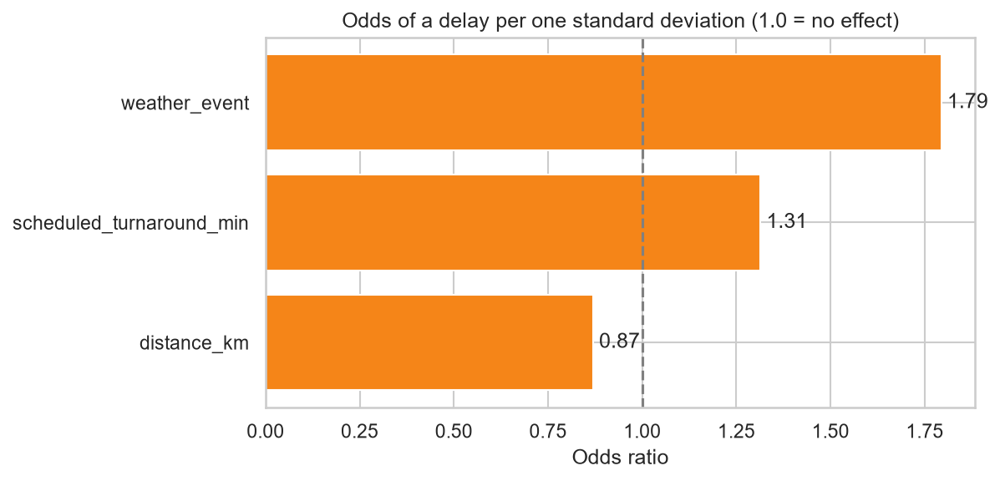
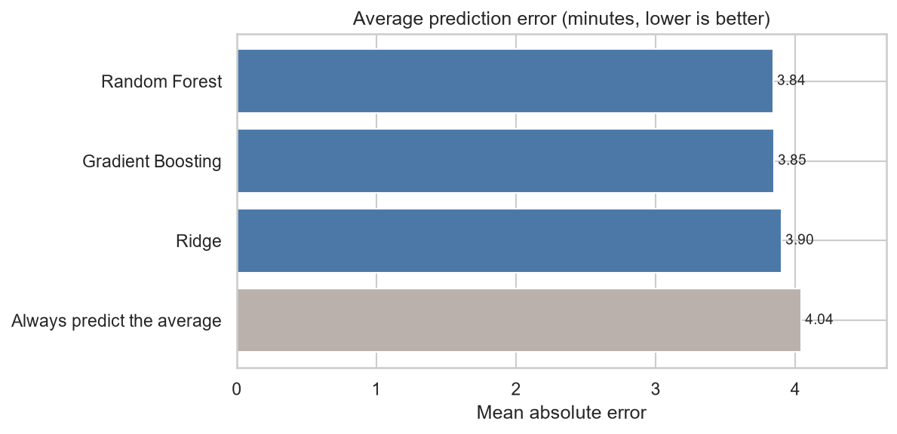

# ✈️ Flight On-Time Performance

**Python, SQL and Excel analysis of about 13,000 flights: which routes run late, what drives delays, and how well can delay minutes be predicted?**

`Python` · `pandas` · `scikit-learn` · `Seaborn` · `SQL` · `Excel` · `Aviation`

---

## 📌 At a glance

| ✈️ Flights (clean) | 🛫 Operated | 🗺️ Routes | 📅 Period | ⏱️ On-time performance | ⛈️ On-time in bad weather |
|:---:|:---:|:---:|:---:|:---:|:---:|
| **12,954** | **12,823** | **8** | **Mar 2023 to Aug 2024** | **90.3%** | **40.4%** |

On time means less than 15 minutes late, measured on flights that were not cancelled.

---

## 🎯 Business questions

1. Which routes have the worst on-time performance?
2. Does weather explain delays?
3. Can we predict whether a flight will be delayed, and by how many minutes?
4. Which flights are unusual?

---

## 💡 Key findings

1. **Route C is the problem route, in both directions.** HUB-SPK-C (85.4%) and SPK-C-HUB (85.5%) have the lowest on-time performance. The other six routes range from 90.9% to 93.2%. Route C flights lose about 10.4 minutes on average, against 7.8 to 8.9 on the others, and route C was below the other routes in **all 18 months** (by 6 points on average).
2. **Weather and turnaround time do not explain it.** About 4% of flights on every route are weather-affected, and scheduled turnaround is about 37 minutes everywhere. The cause lies elsewhere, such as ground operations at airport C, and this data cannot say which.
3. **Weather is the biggest driver of delay.** The 525 weather-affected flights lose **22.8 minutes on average (8.3 otherwise)**, and only **40.4% of them are on time (92.4% otherwise)**.
4. **Delay minutes are hard to predict from these features.** Three models (Random Forest, Gradient Boosting, Ridge) reach an R² of about 0.2 and an average error of about 3.9 minutes, only a little better than always guessing the average (4.04 minutes). Weather adds about 3 minutes of delay in the Ridge model.
5. **The delayed-or-not classifier is modest too.** Logistic regression reaches a ROC-AUC of 0.65. Weather raises the odds of a delay the most (odds ratio 1.79), then longer scheduled turnaround (1.31).
6. **255 flights (2%) were flagged as unusual** by Isolation Forest, mostly very long delays, such as a 137-minute delay on HUB-SPK-B.

---

## 📈 Charts

| | |
|---|---|
|  |  |
|  |  |
|  |  |

---

## ✅ Recommendation

- **Investigate route C first,** on both directions, looking at ground handling and turnaround at airport C.
- **Plan for weather days:** on-time performance falls to 40% when weather hits, so add schedule buffer or ground resources on those days.
- **Do not rely on these three features alone** to predict delays. Better predictions would need extra data, such as airport congestion or crew and aircraft rotation.

---

## 🛠️ How it was built

1. **Cleaning (Python):** removed **35 duplicate `flight_id` rows** (12,989 to 12,954) and excluded **131 cancelled flights** from on-time calculations. 140 missing `actual_turnaround_min` values are left as they are because the column is not used.
2. **On-time performance by route:** share of flights under 15 minutes late.
3. **Logistic regression:** predicts delayed or not, with scaled features so odds ratios are comparable.
4. **Isolation Forest:** flags the 2% most unusual flights.
5. **Model comparison:** Random Forest, Gradient Boosting and Ridge, on the same features and the same train/test split.
6. **SQL and Excel cross-checks:** the same route on-time figures calculated in both. The de-duplicated SQL matches Python exactly. The Excel sheet and the raw SQL include the 35 duplicates, so their figures differ by up to 0.05 percentage points.

---

## 📊 Data

**Synthetic dataset** built for practice, not real airline data. Each row is a flight, with route, aircraft type, distance, scheduled and actual turnaround, delay minutes, weather flag, cancellation flag, load factor and passengers.

---

## 📁 Files in this folder

| File | Description |
|---|---|
| [`notebooks/my_analysis.ipynb`](notebooks/my_analysis.ipynb) | Cleaning, on-time performance, classification, anomaly detection, model comparison |
| [`sql/flights_queries.sql`](sql/flights_queries.sql) | Duplicate check, on-time % (`CASE WHEN`), monthly change (`LAG`), delay quartiles (`NTILE`) |
| [`excel/flights_otp_analysis.xlsx`](excel/flights_otp_analysis.xlsx) | Flights table, on-time % by route with `COUNTIFS`, and a chart |
| [`FINDINGS.md`](FINDINGS.md) | Full write-up |
| `images/` | The charts shown above, saved from the notebook |
| `data/flights.csv` | The dataset |
